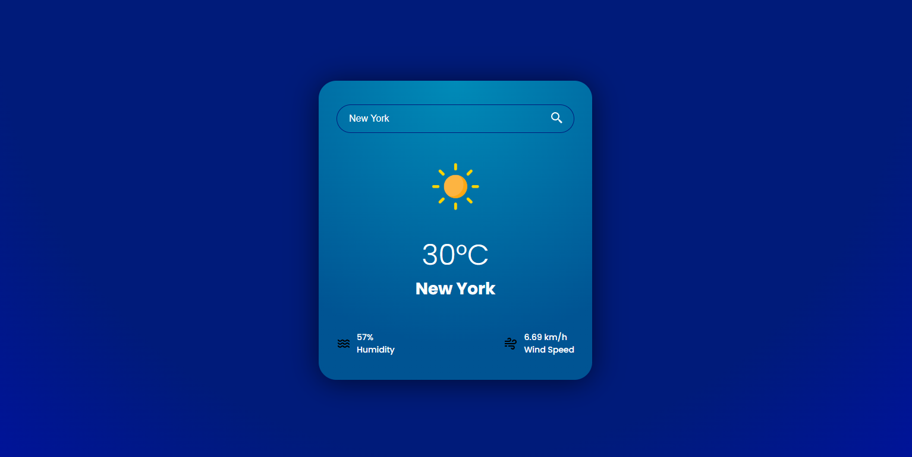

# 🌤️ Weather App

A modern, responsive weather application built with HTML, CSS, and JavaScript that uses the **OpenWeatherMap API** to display real-time weather data for any city in the world.

---

## 🔍 Features

- 🔍 Search weather by city name  
- 🎲 Random city shown on first load  
- 🌡️ Displays temperature, humidity, and wind speed  
- 💎 Clean, smooth UI with animations  
- 📱 Responsive on all devices  
- ❌ Graceful error handling for invalid input  

---

## 🚀 Live Demo

🌐 [Click here to view the live demo](https://weather-six-murex.vercel.app)

---

## 📸 Screenshots




---

## 🛠️ Tech Stack

- **HTML5**
- **CSS3**
- **JavaScript (Vanilla)**
- [OpenWeatherMap API](https://openweathermap.org/api)

---

## 🌐 Getting Started

### 1. Clone the repository

```bash
git clone https://github.com/Midou-Mni/Weather.git
cd Weather
